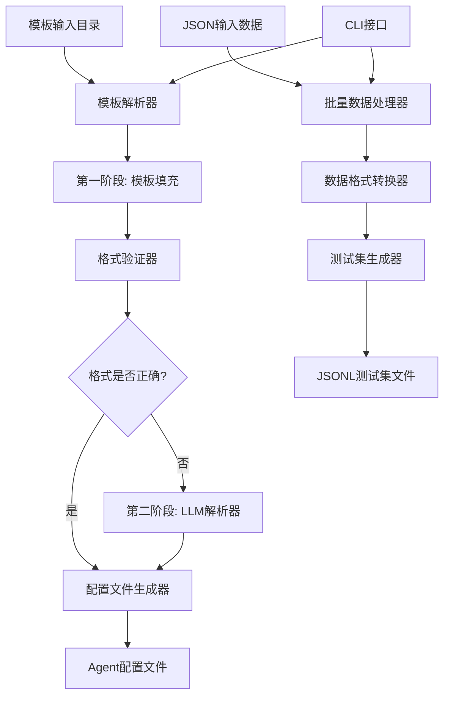

# Design Document

## Overview

Agent模板解析和批量测试集生成系统是一个两阶段的自动化工具，旨在简化Prompt Lab项目中agent的创建和测试数据准备流程。系统通过解析文本模板文件自动生成符合项目规范的agent配置，并支持批量处理JSON数据生成测试集。

## Architecture

### 系统架构图



### 核心组件

1. **模板管理系统**: 负责组织和管理输入的模板文件
2. **模板解析引擎**: 解析模板文件中的变量和结构
3. **配置生成器**: 生成符合项目规范的agent配置
4. **LLM增强处理器**: 使用模型进行格式修正和优化
5. **批量数据处理器**: 处理多个JSON输入并转换为测试集格式

## Components and Interfaces

### 1. 模板管理系统

#### TemplateManager类
```python
class TemplateManager:
    def __init__(self, template_dir: str = "templates"):
        self.template_dir = Path(template_dir)
        self.system_prompt_dir = self.template_dir / "system_prompts"
        self.user_input_dir = self.template_dir / "user_inputs" 
        self.test_cases_dir = self.template_dir / "test_cases"
    
    def create_directory_structure(self) -> None:
        """创建模板目录结构"""
        
    def save_template_files(self, system_prompt: str, user_input: str, test_case: str, agent_name: str) -> Dict[str, Path]:
        """保存模板文件到对应目录"""
        
    def load_template_files(self, agent_name: str) -> Dict[str, str]:
        """加载指定agent的模板文件"""
```

#### 目录结构
```
templates/
├── system_prompts/
│   ├── agent_name_system.txt
│   └── ...
├── user_inputs/
│   ├── agent_name_user.txt
│   └── ...
└── test_cases/
    ├── agent_name_test.json
    └── ...
```

### 2. 模板解析引擎

#### TemplateParser类
```python
class TemplateParser:
    def parse_system_prompt(self, content: str) -> Dict[str, Any]:
        """解析系统提示词模板，提取变量占位符"""
        
    def parse_user_input(self, content: str) -> Dict[str, Any]:
        """解析用户输入模板，识别变量结构"""
        
    def parse_test_case(self, content: str) -> Dict[str, Any]:
        """解析测试case JSON，理解数据结构"""
        
    def extract_variables(self, text: str) -> List[str]:
        """提取${}格式的变量占位符"""
        
    def map_variables_to_config(self, variables: List[str]) -> Dict[str, str]:
        """将变量映射到agent配置字段"""
```

### 3. 配置生成器

#### AgentConfigGenerator类
```python
class AgentConfigGenerator:
    def generate_agent_yaml(self, parsed_data: Dict[str, Any], agent_name: str) -> Dict[str, Any]:
        """生成agent.yaml配置"""
        
    def generate_prompt_yaml(self, parsed_data: Dict[str, Any], agent_name: str) -> Dict[str, Any]:
        """生成prompt.yaml配置"""
        
    def validate_config_format(self, config: Dict[str, Any]) -> List[str]:
        """验证生成的配置格式"""
        
    def save_config_files(self, agent_config: Dict[str, Any], prompt_config: Dict[str, Any], agent_name: str) -> None:
        """保存配置文件到agents目录"""
```

### 4. LLM增强处理器

#### LLMEnhancer类
```python
class LLMEnhancer:
    def __init__(self, model_name: str = "gpt-4"):
        self.model_name = model_name
        
    def fix_config_format(self, config: Dict[str, Any], errors: List[str]) -> Dict[str, Any]:
        """使用LLM修正配置格式错误"""
        
    def optimize_config(self, config: Dict[str, Any]) -> Dict[str, Any]:
        """使用LLM优化配置内容"""
        
    def generate_improvement_suggestions(self, config: Dict[str, Any]) -> List[str]:
        """生成配置改进建议"""
```

### 5. 批量数据处理器

#### BatchDataProcessor类
```python
class BatchDataProcessor:
    def process_json_inputs(self, json_inputs: List[str], target_agent: str) -> List[Dict[str, Any]]:
        """批量处理JSON输入数据"""
        
    def convert_to_testset_format(self, processed_data: List[Dict[str, Any]]) -> List[Dict[str, Any]]:
        """转换为项目testset格式"""
        
    def save_testset(self, testset_data: List[Dict[str, Any]], agent_name: str, filename: str) -> Path:
        """保存测试集到agent的testsets目录"""
        
    def validate_agent_exists(self, agent_name: str) -> bool:
        """验证目标agent是否存在"""
```

### 6. CLI接口

#### AgentTemplateParserCLI类
```python
class AgentTemplateParserCLI:
    def create_agent_from_templates(self, system_prompt_file: str, user_input_file: str, test_case_file: str, agent_name: str) -> None:
        """从模板文件创建agent"""
        
    def batch_create_testsets(self, json_files: List[str], target_agent: str, output_filename: str) -> None:
        """批量创建测试集"""
        
    def list_templates(self) -> None:
        """列出所有可用的模板"""
        
    def validate_templates(self, agent_name: str) -> None:
        """验证模板文件的有效性"""
```

## Data Models

### 模板数据结构

```python
@dataclass
class TemplateData:
    system_prompt: str
    user_input: str
    test_case: Dict[str, Any]
    variables: List[str]
    agent_name: str

@dataclass
class ParsedTemplate:
    system_variables: List[str]
    user_variables: List[str]
    test_structure: Dict[str, Any]
    variable_mappings: Dict[str, str]

@dataclass
class GeneratedConfig:
    agent_config: Dict[str, Any]
    prompt_config: Dict[str, Any]
    validation_errors: List[str]
    needs_llm_enhancement: bool
```

### 变量映射规则

```python
VARIABLE_MAPPINGS = {
    "${sys.user_input}": "chat_round_30",  # 映射到对话历史字段
    "{user}": "{user}",  # 保留用户占位符
    "{role}": "{role}",  # 保留角色占位符
    # 其他系统变量映射...
}
```

## Error Handling

### 错误类型定义

```python
class TemplateParsingError(Exception):
    """模板解析错误"""
    pass

class ConfigGenerationError(Exception):
    """配置生成错误"""
    pass

class LLMEnhancementError(Exception):
    """LLM增强处理错误"""
    pass

class BatchProcessingError(Exception):
    """批量处理错误"""
    pass
```

### 错误处理策略

1. **模板解析错误**: 提供详细的错误位置和修复建议
2. **配置格式错误**: 自动触发LLM增强处理
3. **LLM调用失败**: 回退到基础模板填充，记录警告
4. **文件操作错误**: 提供清晰的权限和路径错误信息
5. **数据验证错误**: 详细列出所有验证失败的字段

### 错误恢复机制

```python
class ErrorRecovery:
    def handle_parsing_error(self, error: TemplateParsingError) -> Dict[str, Any]:
        """处理解析错误，尝试部分恢复"""
        
    def fallback_to_basic_template(self, agent_name: str) -> Dict[str, Any]:
        """回退到基础模板"""
        
    def suggest_fixes(self, errors: List[str]) -> List[str]:
        """生成修复建议"""
```

## Testing Strategy

### 单元测试

1. **模板解析测试**
   - 测试各种变量格式的解析
   - 测试边界情况和错误输入
   - 测试变量映射的正确性

2. **配置生成测试**
   - 测试生成的YAML格式正确性
   - 测试与项目规范的兼容性
   - 测试不同模板组合的处理

3. **LLM增强测试**
   - 模拟LLM响应进行测试
   - 测试错误修正的有效性
   - 测试回退机制

4. **批量处理测试**
   - 测试大量JSON数据的处理
   - 测试数据格式转换的准确性
   - 测试错误数据的处理

### 集成测试

1. **端到端流程测试**
   - 从模板文件到最终agent配置的完整流程
   - 测试生成的agent是否能正常工作
   - 测试生成的测试集是否符合格式要求

2. **与现有系统集成测试**
   - 测试生成的配置与现有评估系统的兼容性
   - 测试文件路径和目录结构的正确性

### 性能测试

1. **大文件处理测试**
   - 测试处理大型模板文件的性能
   - 测试批量处理大量JSON数据的效率

2. **LLM调用优化测试**
   - 测试LLM调用的响应时间
   - 测试并发处理的性能

### 测试数据准备

```python
# 测试用例示例
TEST_CASES = {
    "basic_template": {
        "system_prompt": "你是一个对话总结专家...",
        "user_input": "开始总结。",
        "test_case": '{"sys": {"user_input": "..."}}'
    },
    "complex_variables": {
        "system_prompt": "处理${sys.user_input}和{user}、{role}...",
        "user_input": "输入: {input}",
        "test_case": '{"sys": {"user_input": [...]}}'
    }
}
```