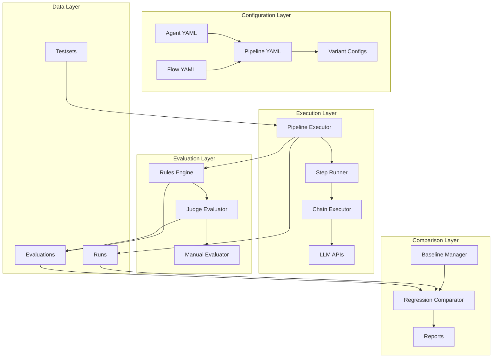

# Design Document

## Overview

The Pipeline Regression System extends the existing Prompt Lab architecture to support multi-step workflow evaluation, systematic baseline comparison, and organized data management. The design maintains backward compatibility while introducing powerful new capabilities for complex prompt engineering workflows.

The system introduces three new core concepts (Pipeline, Step, Baseline/Variant) that work alongside existing Agent and Flow abstractions. The architecture emphasizes modularity, allowing gradual migration from single-agent evaluation to full pipeline workflows.

## Architecture

### High-Level Architecture



### Component Relationships

The system maintains a clear separation of concerns:

- **Configuration Layer**: Manages YAML-based definitions for agents, flows, pipelines, and variants
- **Execution Layer**: Handles pipeline execution, step orchestration, and LLM API calls
- **Evaluation Layer**: Applies rules, LLM judges, and manual evaluation processes
- **Data Layer**: Organizes testsets, runs, and evaluation results by entity type
- **Comparison Layer**: Manages baselines, performs regression analysis, and generates reports

## Components and Interfaces

### Pipeline Configuration System

#### Pipeline YAML Structure
```yaml
id: "pipeline_id"
name: "Pipeline Display Name"
description: "Pipeline purpose and workflow description"
default_testset: "relative/path/to/testset.jsonl"

inputs:
  - name: "input_field_name"
    desc: "Field description for documentation"

steps:
  - id: "step_identifier"
    type: "agent_flow"
    agent: "agent_id"
    flow: "flow_name"
    input_mapping:
      flow_param: "testset_field_or_previous_output"
    output_key: "step_output_identifier"
    model_override: "optional_model_name"

outputs:
  - key: "output_identifier"
    label: "Human readable label"

baseline:
  name: "baseline_name"
  description: "Baseline configuration description"
  steps:
    step_id:
      flow: "baseline_flow_name"

variants:
  variant_name:
    description: "Variant description"
    overrides:
      step_id:
        flow: "alternative_flow_name"
        model: "alternative_model_name"
```

#### Configuration Validation
- Schema validation for all YAML files
- Reference validation (agents, flows, testsets exist)
- Circular dependency detection in pipeline steps
- Input/output mapping validation

### Pipeline Execution Engine

#### PipelineRunner Class
```python
class PipelineRunner:
    def __init__(self, pipeline_config: PipelineConfig):
        self.config = pipeline_config
        self.step_runners = {}
        self.context = {}
    
    def execute(self, testset: List[Dict], variant: str = "baseline") -> List[Dict]:
        """执行管道并返回结果"""
        
    def execute_step(self, step: StepConfig, sample: Dict) -> Dict:
        """执行单个步骤"""
        
    def validate_pipeline(self) -> List[str]:
        """验证管道配置的有效性"""
```

#### Step Execution Strategy
1. **Input Resolution**: Map testset fields and previous outputs to step inputs
2. **Agent/Flow Loading**: Load specified agent and flow configurations
3. **Model Override**: Apply model overrides if specified
4. **Execution**: Run the agent/flow with resolved inputs
5. **Output Storage**: Store step output in pipeline context
6. **Error Handling**: Capture and propagate step-level errors

### Data Organization System

#### Directory Structure
```
data/
├── agents/
│   └── {agent_id}/
│       ├── testsets/
│       │   ├── base.jsonl
│       │   ├── regression.jsonl
│       │   └── edge_cases.jsonl
│       ├── runs/
│       │   └── {flow_name}.{timestamp}.csv
│       └── evals/
│           └── {flow_name}.{timestamp}.{eval_type}.csv
├── pipelines/
│   └── {pipeline_id}/
│       ├── testsets/
│       ├── runs/
│       └── evals/
└── baselines/
    ├── agents/
    │   └── {agent_id}/
    │       └── {baseline_name}.snapshot.json
    └── pipelines/
        └── {pipeline_id}/
            └── {baseline_name}.snapshot.json
```

#### File Naming Conventions
- **Runs**: `{entity_name}.{variant}.{timestamp}.csv`
- **Evaluations**: `{entity_name}.{variant}.{timestamp}.{eval_type}.csv`
- **Baselines**: `{entity_name}.{baseline_name}.snapshot.json`
- **Timestamps**: ISO format `YYYY-MM-DDTHH-MM-SS`

### Testset Enhancement System

#### Enhanced JSONL Format
```json
{
  "id": "unique_sample_id",
  "tags": ["regression", "happy_path", "short_context"],
  "scenario": "user_conversation",
  "priority": "high",
  "expected_outcome": "正确总结对话要点",
  "input_field_1": "sample input data",
  "input_field_2": "additional context",
  "metadata": {
    "created_by": "test_engineer",
    "created_at": "2025-12-08T10:00:00Z"
  }
}
```

#### Tag-Based Filtering
```python
class TestsetFilter:
    def filter_by_tags(self, samples: List[Dict], 
                      include_tags: List[str] = None,
                      exclude_tags: List[str] = None) -> List[Dict]:
        """根据标签过滤测试样本"""
        
    def filter_by_scenario(self, samples: List[Dict], 
                          scenarios: List[str]) -> List[Dict]:
        """根据场景过滤测试样本"""
```

### Evaluation and Comparison System

#### Enhanced Evaluation Pipeline
1. **Rules Evaluation**: Fast filtering of obviously bad outputs
2. **LLM Judge Evaluation**: Business-goal-oriented scoring
3. **Statistical Analysis**: Aggregate metrics and comparisons
4. **Regression Detection**: Identify performance degradation

#### Comparison Engine
```python
class ComparisonEngine:
    def compare_variants(self, baseline_results: List[Dict], 
                        variant_results: List[Dict]) -> ComparisonReport:
        """比较基线和变体的性能"""
        
    def detect_regressions(self, comparison: ComparisonReport, 
                          threshold: float = 0.1) -> List[RegressionCase]:
        """检测性能回归案例"""
        
    def generate_report(self, comparison: ComparisonReport) -> str:
        """生成中文评估报告"""
```

#### Regression Analysis Metrics
- **Overall Score Delta**: Average score difference between baseline and variant
- **Must-Have Pass Rate**: Percentage of samples passing critical requirements
- **Rule Violation Rate**: Percentage of samples violating basic rules
- **Tag-Based Performance**: Performance breakdown by sample tags
- **Worst Regressions**: Individual samples with largest score drops

### CLI Interface Design

#### Command Structure
```bash
# Pipeline evaluation
python -m src eval --pipeline {pipeline_id} --variants {variant_list} --judge --limit {n}

# Regression testing
python -m src eval_regression --pipeline {pipeline_id} --variant {variant_name} --baseline {baseline_name}

# Tag-based filtering
python -m src eval --agent {agent_id} --flows {flow_list} --include-tags {tags} --exclude-tags {tags}

# Baseline management
python -m src baseline save --pipeline {pipeline_id} --variant {variant_name} --name {baseline_name}
python -m src baseline list --pipeline {pipeline_id}
python -m src baseline compare --pipeline {pipeline_id} --baseline {baseline_name} --variant {variant_name}
```

#### Chinese Output Format
All CLI output will be in Chinese with clear formatting:
```
正在执行管道: mem0_l1_pipeline
变体: mem0_prompt_v3
测试集: 50 个样本

步骤 1/2: asr_clean (asr_cleaner/asr_clean_v1) ✓
步骤 2/2: mem0_summary (mem0_l1_summarizer/mem0_l1_v3) ✓

执行完成! 结果保存至: data/pipelines/mem0_l1_pipeline/runs/mem0_l1_pipeline.mem0_prompt_v3.2025-12-08T10-30-00.csv

开始评估...
规则评估: 48/50 通过 (96%)
LLM 评估: 平均分 8.2/10
```

## Data Models

### Core Data Structures

#### PipelineConfig
```python
@dataclass
class PipelineConfig:
    id: str
    name: str
    description: str
    default_testset: str
    inputs: List[InputSpec]
    steps: List[StepConfig]
    outputs: List[OutputSpec]
    baseline: BaselineConfig
    variants: Dict[str, VariantConfig]
```

#### StepConfig
```python
@dataclass
class StepConfig:
    id: str
    type: str  # "agent_flow" for now, extensible
    agent: str
    flow: str
    input_mapping: Dict[str, str]
    output_key: str
    model_override: Optional[str] = None
```

#### EvaluationResult
```python
@dataclass
class EvaluationResult:
    sample_id: str
    variant: str
    overall_score: float
    must_have_pass: bool
    rule_violations: List[str]
    judge_feedback: str
    execution_time: float
    step_outputs: Dict[str, Any]
```

#### ComparisonReport
```python
@dataclass
class ComparisonReport:
    baseline_name: str
    variant_name: str
    sample_count: int
    score_delta: float
    must_have_delta: float
    rule_violation_delta: float
    tag_performance: Dict[str, float]
    worst_regressions: List[RegressionCase]
    summary: str
```

## Error Handling

### Error Categories and Responses

1. **Configuration Errors**
   - Invalid YAML syntax → 配置文件语法错误，请检查 YAML 格式
   - Missing references → 引用的 Agent/Flow 不存在: {reference}
   - Circular dependencies → 检测到循环依赖: {cycle_path}

2. **Execution Errors**
   - Step failure → 步骤 {step_id} 执行失败: {error_message}
   - API errors → LLM API 调用失败，请检查网络和配置
   - Timeout errors → 步骤执行超时，请考虑增加超时设置

3. **Data Errors**
   - Missing testset → 测试集文件不存在: {file_path}
   - Invalid sample format → 样本格式错误: {validation_errors}
   - File I/O errors → 文件操作失败: {io_error}

### Recovery Strategies

- **Graceful Degradation**: Continue processing remaining samples when individual samples fail
- **Checkpoint Resume**: Save progress and allow resuming from last successful step
- **Partial Results**: Generate reports even when some evaluations fail
- **Clear Error Messages**: Provide actionable error messages in Chinese

## Testing Strategy

### Unit Testing
- **Configuration Loading**: Test YAML parsing and validation
- **Pipeline Execution**: Test step execution and data flow
- **Evaluation Logic**: Test rules engine and judge evaluation
- **Comparison Engine**: Test baseline comparison and regression detection

### Integration Testing
- **End-to-End Pipelines**: Test complete pipeline execution workflows
- **CLI Interface**: Test all command-line operations
- **Data Migration**: Test migration from legacy data structure
- **Error Scenarios**: Test error handling and recovery

### Performance Testing
- **Large Testsets**: Test with 1000+ samples
- **Complex Pipelines**: Test with 5+ step pipelines
- **Concurrent Execution**: Test parallel evaluation capabilities
- **Memory Usage**: Monitor memory consumption with large datasets

### Acceptance Testing
- **User Workflows**: Test common user scenarios end-to-end
- **Migration Scenarios**: Test gradual migration from existing system
- **Chinese Output**: Verify all output is properly localized
- **Backward Compatibility**: Ensure existing commands continue to work