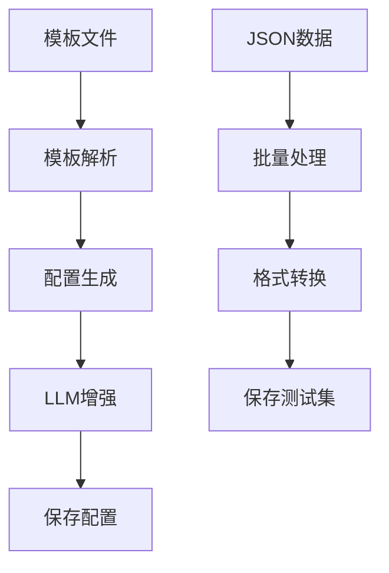

# Agent Template Parser 使用指南

本指南将详细介绍如何使用 Agent Template Parser 的各项功能。

## 目录

1. [环境准备](#环境准备)
2. [基础概念](#基础概念)
3. [模板文件创建](#模板文件创建)
4. [Agent 配置生成](#agent-配置生成)
5. [批量测试集生成](#批量测试集生成)
6. [高级功能](#高级功能)
7. [实际案例](#实际案例)
8. [性能优化](#性能优化)

## 环境准备

### 1. 安装依赖

```bash
# 确保 Python 版本 >= 3.8
python --version

# 安装项目依赖
pip install -r requirements.txt

# 可选：设置 OpenAI API Key（用于 LLM 增强功能）
export OPENAI_API_KEY="your-api-key-here"
```

### 2. 验证安装

```bash
# 测试 CLI 工具
python -m src.agent_template_parser.cli --help

# 运行测试确保功能正常
python -m pytest tests/test_agent_template_parser* -v
```

## 基础概念

### 核心组件

1. **TemplateManager**: 管理模板文件的存储和组织
2. **TemplateParser**: 解析模板文件，提取变量和结构信息
3. **AgentConfigGenerator**: 生成符合项目规范的 agent 配置文件
4. **BatchDataProcessor**: 批量处理 JSON 数据，生成测试集
5. **LLMEnhancer**: 使用 LLM 优化和修正配置文件

### 工作流程



## 模板文件创建

### 1. 目录结构

```
templates/
├── system_prompts/     # 系统提示词模板
├── user_inputs/        # 用户输入模板
└── test_cases/         # 测试用例文件
```

### 2. 系统提示词模板

**文件名格式**: `{agent_name}_system.txt`

**示例**: `conversation_summarizer_system.txt`

```text
你是一个专业的{role}。你的任务是{task_description}。

处理以下输入：${sys.user_input}

请为用户{user}提供{service_type}，考虑以下要求：
1. {requirement_1}
2. {requirement_2}
3. {requirement_3}

输出格式：{output_format}
```

**变量类型说明**:
- `${sys.user_input}`: 系统变量，自动映射到对话历史
- `{user}`, `{role}`: 运行时占位符
- `{custom_field}`: 自定义字段，从测试用例中提取

### 3. 用户输入模板

**文件名格式**: `{agent_name}_user.txt`

**示例**: `conversation_summarizer_user.txt`

```text
请{action_verb}以下内容：
{input_content}

要求：
- 类型：{content_type}
- 长度：{expected_length}
- 重点：{focus_area}

请根据上述要求提供专业的{output_type}。
```

### 4. 测试用例文件

**文件名格式**: `{agent_name}_test.json`

**示例**: `conversation_summarizer_test.json`

```json
{
  "sys": {
    "user_input": [
      {
        "role": "user",
        "content": "用户的输入内容"
      },
      {
        "role": "assistant",
        "content": "助手的回复内容"
      }
    ]
  },
  "input_content": "需要处理的具体内容",
  "content_type": "对话记录",
  "expected_length": "200字以内",
  "focus_area": "关键决策点",
  "output_type": "总结报告"
}
```

## Agent 配置生成

### 1. 使用 CLI 工具

```bash
# 基础用法
python -m src.agent_template_parser.cli create-agent \
  --system-prompt templates/system_prompts/my_agent_system.txt \
  --user-input templates/user_inputs/my_agent_user.txt \
  --test-case templates/test_cases/my_agent_test.json \
  --agent-name my_agent

# 禁用 LLM 增强
python -m src.agent_template_parser.cli create-agent \
  --system-prompt templates/system_prompts/my_agent_system.txt \
  --user-input templates/user_inputs/my_agent_user.txt \
  --test-case templates/test_cases/my_agent_test.json \
  --agent-name my_agent \
  --no-llm-enhancement
```

### 2. 使用 Python API

```python
from src.agent_template_parser import (
    TemplateManager,
    TemplateParser,
    AgentConfigGenerator
)

# 1. 初始化组件
template_manager = TemplateManager()
parser = TemplateParser()
config_generator = AgentConfigGenerator()

# 2. 读取模板文件
with open('templates/system_prompts/my_agent_system.txt', 'r') as f:
    system_prompt = f.read()

with open('templates/user_inputs/my_agent_user.txt', 'r') as f:
    user_input = f.read()

with open('templates/test_cases/my_agent_test.json', 'r') as f:
    test_case = f.read()

# 3. 解析模板
system_data = parser.parse_system_prompt(system_prompt)
user_data = parser.parse_user_input(user_input)
test_data = parser.parse_test_case(test_case)

# 4. 创建解析结果
parsed_template = parser.create_parsed_template(
    system_data, user_data, test_data
)

# 5. 生成配置
agent_config = config_generator.generate_agent_yaml(
    parsed_template, "my_agent"
)
prompt_config = config_generator.generate_prompt_yaml(
    parsed_template, "my_agent",
    original_system_prompt=system_prompt,
    original_user_template=user_input
)

# 6. 保存配置
config_generator.save_config_files(
    agent_config, prompt_config, "my_agent"
)
```

### 3. 生成的文件结构

```
agents/
└── my_agent/
    ├── agent.yaml          # Agent 配置文件
    ├── prompts/
    │   └── my_agent_v1.yaml # Prompt 配置文件
    └── testsets/           # 测试集目录
```

## 批量测试集生成

### 1. 准备 JSON 数据

创建多个 JSON 文件，每个文件包含一个测试用例：

**文件**: `data1.json`
```json
{
  "sys": {
    "user_input": [
      {"role": "user", "content": "用户输入1"},
      {"role": "assistant", "content": "助手回复1"}
    ]
  },
  "field1": "值1",
  "field2": "值2"
}
```

**文件**: `data2.json`
```json
{
  "sys": {
    "user_input": [
      {"role": "user", "content": "用户输入2"},
      {"role": "assistant", "content": "助手回复2"}
    ]
  },
  "field1": "值3",
  "field2": "值4"
}
```

### 2. 使用 CLI 工具

```bash
# 批量处理多个 JSON 文件
python -m src.agent_template_parser.cli create-testset \
  --json-files data1.json data2.json data3.json \
  --target-agent existing_agent \
  --output-filename batch_testset.jsonl

# 使用通配符处理多个文件
python -m src.agent_template_parser.cli create-testset \
  --json-files data/*.json \
  --target-agent existing_agent \
  --output-filename all_data.jsonl
```

### 3. 使用 Python API

```python
from src.agent_template_parser import BatchDataProcessor
import json

# 1. 初始化处理器
processor = BatchDataProcessor()

# 2. 读取 JSON 文件
json_inputs = []
for file_path in ['data1.json', 'data2.json', 'data3.json']:
    with open(file_path, 'r', encoding='utf-8') as f:
        json_inputs.append(f.read())

# 3. 处理数据
processed_data = processor.process_json_inputs(json_inputs, "target_agent")

# 4. 转换格式
testset_data = processor.convert_to_testset_format(processed_data)

# 5. 保存测试集
output_path = processor.save_testset(
    testset_data, "target_agent", "output.jsonl"
)

print(f"测试集已保存到: {output_path}")
```

### 4. 生成的测试集格式

```jsonl
{"id": 1, "chat_round_30": [{"role": "user", "content": "用户输入1"}, {"role": "assistant", "content": "助手回复1"}], "field1": "值1", "field2": "值2", "tags": []}
{"id": 2, "chat_round_30": [{"role": "user", "content": "用户输入2"}, {"role": "assistant", "content": "助手回复2"}], "field1": "值3", "field2": "值4", "tags": []}
```

## 高级功能

### 1. LLM 增强配置

LLM 增强功能可以自动优化生成的配置文件：

```python
from src.agent_template_parser import LLMEnhancer

# 初始化 LLM 增强器
enhancer = LLMEnhancer(
    model_name="gpt-4",
    max_retries=3,
    fallback_enabled=True
)

# 优化配置
enhanced_config = enhancer.optimize_config(agent_config)

# 修复格式错误
fixed_config = enhancer.fix_config_format(
    agent_config, 
    ["Missing required field: description"]
)
```

### 2. 自定义变量映射

```python
from src.agent_template_parser.template_parser import VARIABLE_MAPPINGS

# 添加自定义映射
VARIABLE_MAPPINGS.update({
    "${custom.field}": "custom_mapping",
    "${special.input}": "special_field"
})
```

### 3. 错误处理和恢复

```python
from src.agent_template_parser.error_handler import ErrorRecovery

# 初始化错误恢复器
error_recovery = ErrorRecovery()

try:
    # 执行可能出错的操作
    result = some_operation()
except Exception as e:
    # 尝试恢复
    recovery_result = error_recovery.handle_error(e, context)
    if recovery_result.success:
        result = recovery_result.recovered_data
    else:
        print("恢复失败:", recovery_result.suggestions)
```

## 实际案例

### 案例 1: 对话总结 Agent

**需求**: 创建一个能够总结客户服务对话的 Agent

**步骤**:

1. **创建系统提示词模板**:
```text
你是一个专业的客户服务对话分析师。请分析以下客户服务对话：${sys.user_input}

为{user}生成对话总结，重点关注：
1. 客户问题的核心内容
2. 服务人员的解决方案
3. 问题解决状态
4. 客户满意度

输出格式：
- 问题类型：[分类]
- 问题描述：[简要描述]
- 解决方案：[采取的措施]
- 结果状态：[已解决/待跟进/升级处理]
```

2. **创建用户输入模板**:
```text
请分析以下客户服务对话：
{conversation_content}

客户类型：{customer_type}
问题类别：{issue_category}
优先级：{priority_level}
```

3. **创建测试用例**:
```json
{
  "sys": {
    "user_input": [
      {"role": "user", "content": "我的订单还没有收到，已经超过预计时间了"},
      {"role": "assistant", "content": "很抱歉给您带来不便，我来帮您查询订单状态..."}
    ]
  },
  "conversation_content": "物流延迟投诉",
  "customer_type": "VIP客户",
  "issue_category": "物流问题",
  "priority_level": "高"
}
```

4. **生成 Agent**:
```bash
python -m src.agent_template_parser.cli create-agent \
  --system-prompt templates/system_prompts/customer_service_analyzer_system.txt \
  --user-input templates/user_inputs/customer_service_analyzer_user.txt \
  --test-case templates/test_cases/customer_service_analyzer_test.json \
  --agent-name customer_service_analyzer
```

### 案例 2: 批量处理客户反馈

**需求**: 将大量客户反馈 JSON 数据转换为测试集

**步骤**:

1. **准备客户反馈数据** (`feedback_*.json`):
```json
{
  "sys": {
    "user_input": [
      {"role": "user", "content": "产品质量很好，但是包装可以改进"},
      {"role": "assistant", "content": "感谢您的反馈，我们会将您的建议转达给相关部门"}
    ]
  },
  "feedback_type": "产品建议",
  "rating": 4,
  "product_id": "PROD001",
  "customer_segment": "老客户"
}
```

2. **批量处理**:
```bash
python -m src.agent_template_parser.cli create-testset \
  --json-files feedback_*.json \
  --target-agent customer_service_analyzer \
  --output-filename customer_feedback_testset.jsonl
```

3. **验证结果**:
```bash
# 检查生成的测试集
head -n 5 agents/customer_service_analyzer/testsets/customer_feedback_testset.jsonl

# 验证格式
python -c "
import json
with open('agents/customer_service_analyzer/testsets/customer_feedback_testset.jsonl', 'r') as f:
    for i, line in enumerate(f):
        data = json.loads(line)
        print(f'Entry {i+1}: {list(data.keys())}')
        if i >= 2: break
"
```

## 性能优化

### 1. 批量处理优化

```python
# 分批处理大量文件
def process_large_dataset(json_files, batch_size=100):
    processor = BatchDataProcessor()
    
    for i in range(0, len(json_files), batch_size):
        batch = json_files[i:i+batch_size]
        print(f"处理批次 {i//batch_size + 1}: {len(batch)} 个文件")
        
        # 处理当前批次
        json_inputs = []
        for file_path in batch:
            with open(file_path, 'r') as f:
                json_inputs.append(f.read())
        
        processed_data = processor.process_json_inputs(json_inputs, "target_agent")
        testset_data = processor.convert_to_testset_format(processed_data)
        
        # 保存批次结果
        output_file = f"batch_{i//batch_size + 1}.jsonl"
        processor.save_testset(testset_data, "target_agent", output_file)
```

### 2. 内存优化

```python
# 流式处理大文件
def stream_process_json_files(file_paths, target_agent):
    processor = BatchDataProcessor()
    
    with open(f"agents/{target_agent}/testsets/stream_output.jsonl", 'w') as output_file:
        for file_path in file_paths:
            with open(file_path, 'r') as f:
                json_input = f.read()
            
            # 单个处理
            processed_data = processor.process_json_inputs([json_input], target_agent)
            testset_data = processor.convert_to_testset_format(processed_data)
            
            # 立即写入，释放内存
            for entry in testset_data:
                output_file.write(json.dumps(entry, ensure_ascii=False) + '\n')
```

### 3. 缓存机制

```python
import functools
import hashlib

# 缓存模板解析结果
@functools.lru_cache(maxsize=128)
def cached_parse_template(template_content_hash):
    parser = TemplateParser()
    return parser.parse_system_prompt(template_content)

# 使用缓存
def parse_with_cache(template_content):
    content_hash = hashlib.md5(template_content.encode()).hexdigest()
    return cached_parse_template(content_hash)
```

## 故障排除

### 常见问题及解决方案

1. **模板解析失败**
   - 检查文件编码（应为 UTF-8）
   - 验证 JSON 格式
   - 确认变量语法正确

2. **配置生成错误**
   - 确保所有模板文件存在
   - 检查 agent 名称格式
   - 验证目录权限

3. **批量处理失败**
   - 确认目标 agent 存在
   - 检查 JSON 文件格式
   - 验证磁盘空间

4. **LLM 增强失败**
   - 设置正确的 API Key
   - 检查网络连接
   - 考虑使用 `--no-llm-enhancement`

### 调试技巧

```python
# 启用详细日志
import logging
logging.basicConfig(level=logging.DEBUG)

# 验证单个组件
parser = TemplateParser()
try:
    result = parser.parse_system_prompt(content)
    print("解析成功:", result)
except Exception as e:
    print("解析失败:", e)

# 检查生成的配置
import yaml
with open('agents/my_agent/agent.yaml', 'r') as f:
    config = yaml.safe_load(f)
    print("配置结构:", list(config.keys()))
```

---

通过本指南，您应该能够熟练使用 Agent Template Parser 的所有功能。如有问题，请参考故障排除部分或查看项目文档。